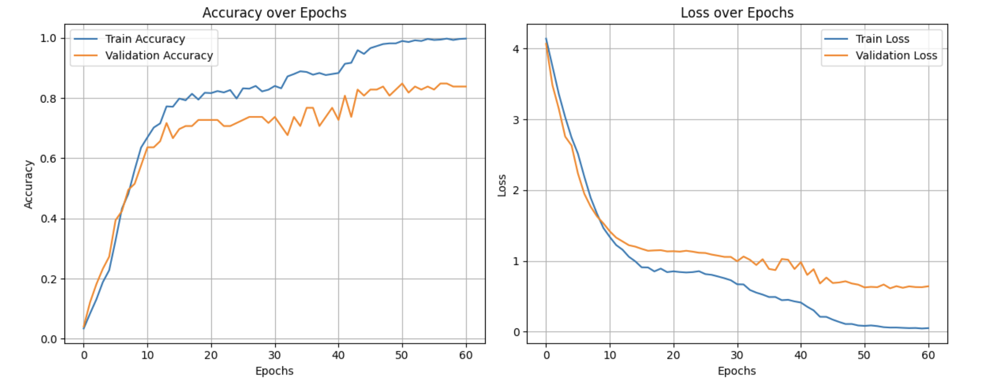
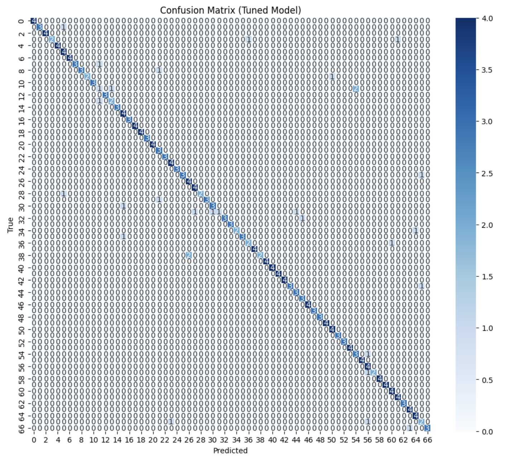

# 🇰🇷 Koala (코아라) - Korean Sign Language (KSL) Recognition System

This is the repository for the Koala (코아라), a full-stack application that uses a deep learning model to classify dynamic Korean Sign Language (KSL) words from user video input. The system provides real-time AI feedback to help users practice KSL signs.

---

## What it Does

Koala addresses the need for accessible KSL learning tools by utilizing a vision-based approach. The system extracts 47 3D joint coordinates from video frames using MediaPipe Holistic and feeds this sequence data into a specialized CNN-LSTM-Attention model.

This model analyzes the spatial and temporal patterns of the signs to classify them against 67 distinct KSL words. The system is deployed as a user-friendly web application with a FastAPI backend serving the PyTorch model and a React/TypeScript frontend for recording and displaying AI-driven results.

---

## Quick Start

This guide explains how to run the full-stack Koala application locally.

### Prerequisites
* Python 3.9+
* Node.js / npm
* The trained model file (`best_model.pt`) is required in the `backend/` directory.

### 1. Backend Setup (FastAPI)

1. **Clone the repository and navigate to the backend:**
   ```bash
   git clone https://github.com/JonathanReyess/koala-sign-learn.git
   cd koala-sign-learn/backend
   ```

2. **Create and activate a virtual environment:**
   ```bash
   python -m venv venv
   source venv/bin/activate  # On Windows: venv\Scripts\activate
   ```

3. **Install Python dependencies:**
   ```bash
   pip install -r requirements.txt
   ```

4. **Run the API server:**
   ```bash
   uvicorn main:app --reload --host 0.0.0.0 --port 8000
   ```
   The API will be available at `http://localhost:8000`.

### 2. Frontend Setup (React)

1. **Navigate to the frontend directory:**
   ```bash
   cd ../frontend
   ```

2. **Install Node dependencies:**
   ```bash
   npm install
   ```

3. **Configure API URL:**
   ```bash
   # Create .env file in frontend/
   echo "VITE_API_URL=http://localhost:8000" > .env
   ```

4. **Run the web application:**
   ```bash
   npm run dev
   ```
   The web application will typically open in your browser at `http://localhost:5173`.

---

## Evaluation

The model was trained and evaluated on the KSL77 dataset (67 classes) by [Yangseung/KSL](https://github.com/Yangseung/KSL)

### Training Data
- **Total Samples:** 1,228 video sequences
- **Feature Shape:** (1228, 3, 32, 47) - 3 spatial dimensions, 32 frames, 47 keypoints
- **Split:** 70% Train (28 batches), 10% Validation (4 batches), 20% Test (8 batches)

### Model Performance

| Metric | Value |
| :--- | :--- |
| **Test Accuracy** | 88.21% |
| **Precision (Macro Avg)** | 0.91 |
| **Recall (Macro Avg)** | 0.88 |
| **F1-Score (Macro Avg)** | 0.88 |
| **Framework** | PyTorch |
| **Best Hyperparameters** | `lr`: 0.00034, `cnn_hidden`: 64, `lstm_hidden`: 256, `dropout_rate`: 0.222, `optimizer`: Adam |

### Model Architecture (`PoseCNN_LSTM_Attn`)

The architecture is based on the principles in the paper: ["Dynamic Korean Sign Language Recognition Using Pose Estimation Based and Attention‑Based Neural Network"](https://ieeexplore.ieee.org/document/10360810).

1. **Feature Extraction:** MediaPipe Holistic extracts a fixed-length sequence of 47 keypoints (normalized 3D coordinates) per frame for a 32-frame clip.
2. **Spatial Modeling (CNN):** `Conv1d` layers process the 47 joint features to extract spatial relationships.
3. **Temporal Modeling (LSTM):** A Bidirectional LSTM processes the sequence of spatial features for long-range temporal dependencies.
4. **Feature Aggregation (Attention):** An Attention Pooling mechanism computes a weighted context vector over all time steps to create a single, discriminative feature vector for classification.

---

## Results Visualization

### Training Curves

The following plots illustrate the model's accuracy and loss convergence over the training and validation epochs.



### Confusion Matrix

This matrix visualizes the performance of the final model across all 67 KSL classes on the test set. The strong diagonal indicates good performance, with off-diagonal elements highlighting specific misclassifications.



---

## Video Links

* [[Demo Video](https://drive.google.com/file/d/1yLzAQuSom0Jd4RHR5TRBISpGadesfTPI/view?usp=sharing)]

* [[Technical Walktrough](https://drive.google.com/file/d/1Lt1UWiWIKzmVFABiiG2bvR8rSkJSy9c3/view?usp=sharing)]

---

## Development Details

A detailed Jupyter Notebook is included in the `notebook/` folder, providing a full walkthrough of video preprocessing, feature extraction, and model training (run on Google Colab using an NVIDIA T4 GPU).

---
## Limitations
The model is currently trained on the KSL77 dataset (1,228 video samples) due to the scarcity of publicly and globally accessible Korean Sign Language datasets.

While a significantly larger and more comprehensive resource exists—the KSL-Guide dataset (121,000 video samples, including interrogative sentences, as described in Ham et al., FG 2021)—its access is severely restricted. The dataset is hosted on thethe [Korean AI-Hub platform](https://aihub.or.kr/aihubdata/data/view.do?currMenu=115&topMenu=100&aihubDataSe=realm&dataSetSn=103), which limits data application and download to Korean citizens only.

This accessibility constraint prevents our system from being trained on a richer, more diverse corpus, thereby limiting the vocabulary scope and generalization capability of the current model. Future work could benefit from:
* Collaboration with Korean institutions for dataset access
* Development of transfer learning approaches using related sign language datasets
* Community-driven data collection efforts to expand the available corpus
---

## License

This project is licensed under the MIT License - see the [LICENSE](LICENSE) file for details.

---

