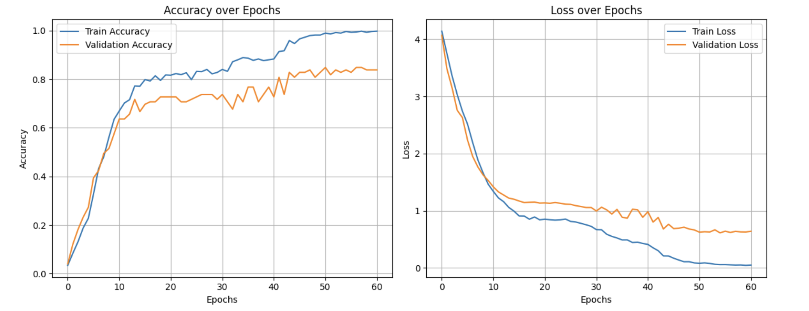
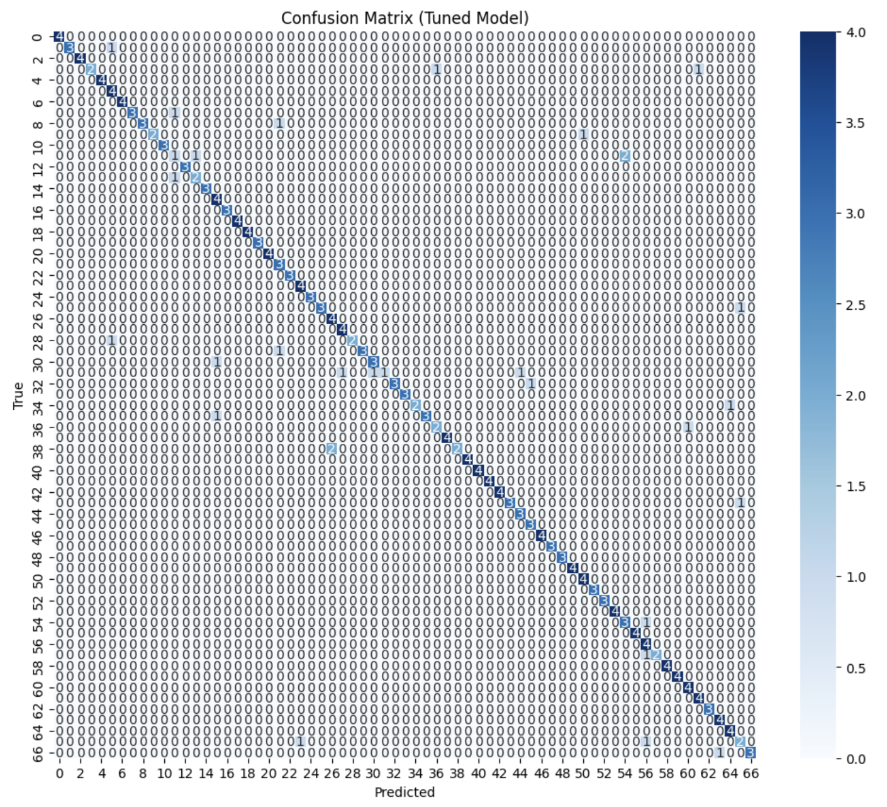

# 🇰🇷 Koala (코아라) - Korean Sign Language (KSL) Recognition System

> **⚠️ `src/backend/` is deprecated.** The FastAPI server has been replaced by
> in-browser inference in PR 3 (MediaPipe landmark extraction + the ONNX model,
> both running client-side with `onnxruntime-web`). The frontend makes no
> network calls to any API. The backend is kept in the repo for history only.

This is the repository for the Koala (코아라), a full-stack application that uses a deep learning model to classify dynamic Korean Sign Language (KSL) words from user video input. The system provides real-time AI feedback to help users practice KSL signs.

---

## What it Does

Koala addresses the need for accessible KSL learning tools by utilizing a vision-based approach. The system extracts 47 3D joint coordinates from video frames using MediaPipe Holistic and feeds this sequence data into a specialized CNN-LSTM-Attention model.

This model analyzes the spatial and temporal patterns of the signs to classify them against 67 distinct KSL words (the raw KSL-77 dataset has 77 folder IDs, but only 67 have training videos — see below). All 67 are in the practice vocabulary, grouped into themed decks; a word is offered as soon as its two demo clips are in `src/frontend/public/videos` (all 67 have them; `scripts/make_demo_clips.py` generates them). Held-out accuracy varies by sign (RESULTS.md), and the weakest are tagged "tricky" in the app. The system is deployed as a user-friendly web application with a React/TypeScript frontend that runs MediaPipe and the exported ONNX model entirely in the browser (no server).

---

## Quick Start

This guide explains how to run the full-stack Koala application locally.

### Prerequisites

- Node.js / npm. That's all — inference runs in the browser, so there is no backend to start.

### Frontend Setup (React)

1. **Install Node dependencies** (also copies the MediaPipe/ONNX WASM runtimes into `public/wasm/`):

   ```bash
   cd src/frontend
   npm install
   ```

2. **Run the web application:**

   ```bash
   npm run dev
   ```
   The app is served at `http://localhost:8080`. Open **Learn** and allow camera access.

3. **Run the tests** (preprocessing + ONNX golden-vector gate):

   ```bash
   npm test
   ```

---

## Evaluation

The model was trained and evaluated on the KSL77 dataset (67 classes, drawn from the 77-slot raw KSL-Videos folder numbering — not all 77 folders had video) by [Yangseung/KSL](https://github.com/Yangseung/KSL)

### Training Data

- **Total Samples:** 1,228 video sequences
- **Feature Shape:** (1228, 3, 32, 47) - 3 spatial dimensions, 32 frames, 47 keypoints
- **Split:** 70% Train (28 batches), 10% Validation (4 batches), 20% Test (8 batches)

### Model Performance

| Metric                    | Value                                                                                         |
| :------------------------ | :-------------------------------------------------------------------------------------------- |
| **Test Accuracy**         | 88.21%                                                                                        |
| **Precision (Macro Avg)** | 0.91                                                                                          |
| **Recall (Macro Avg)**    | 0.88                                                                                          |
| **F1-Score (Macro Avg)**  | 0.88                                                                                          |
| **Framework**             | PyTorch                                                                                       |
| **Best Hyperparameters**  | `lr`: 0.00034, `cnn_hidden`: 64, `lstm_hidden`: 256, `dropout_rate`: 0.222, `optimizer`: Adam |

> **A note on that 88.21%:** the test split is a plain random per-video split (stratified by class only), not grouped by signer — and the dataset has only 3–4 test samples per class. The feature-extraction pipeline doesn't retain signer identity at all, so it's not possible to confirm from this data whether the same signer appears in both the train and test sets. If they do (plausible, given how few samples exist per class), this number is likely optimistic relative to how the model performs on a genuinely unseen signer. Treat 88.21% as an upper bound, not a generalization guarantee.

### Model Architecture (`PoseCNN_LSTM_Attn`)

The architecture is based on the principles in the paper: ["Dynamic Korean Sign Language Recognition Using Pose Estimation Based and Attention‑Based Neural Network"](https://ieeexplore.ieee.org/document/10360810).

1. **Feature Extraction:** MediaPipe Holistic extracts a fixed-length sequence of 47 keypoints (normalized 3D coordinates) per frame for a 32-frame clip.
2. **Spatial Modeling (CNN):** `Conv1d` layers process the 47 joint features to extract spatial relationships.
3. **Temporal Modeling (LSTM):** A Bidirectional LSTM processes the sequence of spatial features for long-range temporal dependencies.
4. **Feature Aggregation (Attention):** An Attention Pooling mechanism computes a weighted context vector over all time steps to create a single, discriminative feature vector for classification.

---

## Results Visualization

### Training Curves

The following plots illustrate the model's accuracy and loss convergence over the training and validation epochs.



### Confusion Matrix

This matrix visualizes the performance of the final model across all 67 KSL classes on the test set. The strong diagonal indicates good performance, with off-diagonal elements highlighting specific misclassifications.



---

## Video Links

- [Demo Video](https://drive.google.com/file/d/1b9czzLfGwZcK22BcA7fIx6b-XnY-YSQF/view?usp=sharing)

- [Technical Walktrough](https://drive.google.com/file/d/1Lt1UWiWIKzmVFABiiG2bvR8rSkJSy9c3/view?usp=sharing)

---

## Development Details

A detailed Jupyter Notebook is included in the `notebook/` folder, providing a full walkthrough of video preprocessing, feature extraction, and model training (run on Google Colab using an NVIDIA T4 GPU).

---

## Limitations

The model is currently trained on the KSL77 dataset (1,228 video samples) due to the scarcity of publicly and globally accessible Korean Sign Language datasets.

While a significantly larger and more comprehensive resource exists—the KSL-Guide dataset (121,000 video samples, including interrogative sentences, as described in Ham et al., FG 2021)—its access is severely restricted. The dataset is hosted on the [Korean AI-Hub platform](https://aihub.or.kr/aihubdata/data/view.do?currMenu=115&topMenu=100&aihubDataSe=realm&dataSetSn=103), which limits data application and download to Korean citizens only.

This accessibility constraint prevents our system from being trained on a richer, more diverse corpus, thereby limiting the vocabulary scope and generalization capability of the current model. Future work could benefit from:

- Collaboration with Korean institutions for dataset access
- Development of transfer learning approaches using related sign language datasets
- Community-driven data collection efforts to expand the available corpus

---

## License

This project's source code is licensed under the MIT License - see the [LICENSE](LICENSE) file for details.

**This does not cover the data.** The trained model weights (`src/backend/best_model.pt`), the extracted feature file (`data/KSL77_joint_stream_47pt.pkl`), and the example videos under `src/frontend/public/videos/` are all derived from the KSL-77 dataset, which is licensed **CC BY-NC 4.0** (non-commercial, attribution required) — see [`data/DATA_README.md`](data/DATA_README.md) and [`ATTRIBUTION.md`](ATTRIBUTION.md). They are not MIT-licensed and are not cleared for commercial use.

**Demo clips and signers:** the demo clips exclude signers 05 and 06 (minors) and 08 (left-handed), and show one male- and one female-presenting signer per word where available (`data/signers.csv`). All signers' landmarks are still used for training and evaluation; only the videos displayed in the app are filtered.

---
